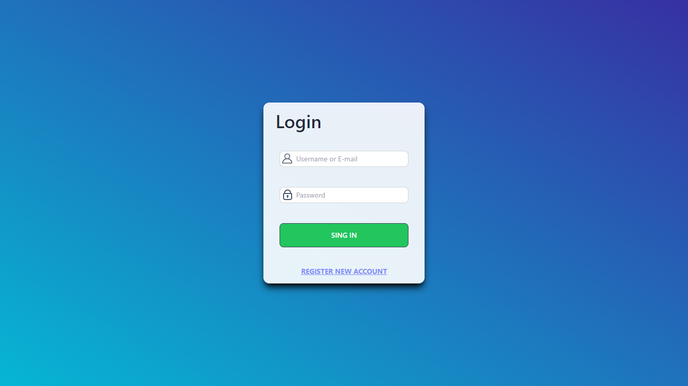
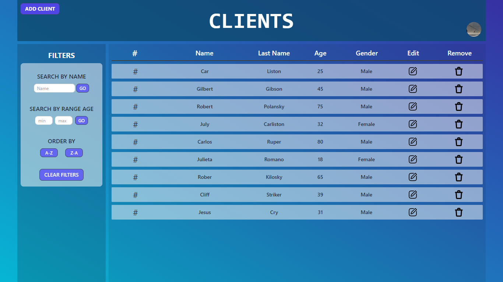

# Challenge-LogIn
<p align="center">
  
</p>
<p align="center">
  
</p>


La prueba consiste en:

1. Generar un api REST usando NodeJS, esta debe permitir:

   - LogIn de usuarios, los usuarios deben tener un rol administrador y un rol visitante.
   - CRUD completo que permitirá crear, leer, editar y eliminar datos de una tabla en cliente
(Front de ReactJS).

1. Crear una web utilizando ReactJS, la web debe incluir:
    - Página de login, debo acceder con usuario/correo y contraseña
Interfaz de control de datos:
    - Debe contar con un formulario para agregar nueva data.
    - Una tabla que muestre la información que llegue del API.
    - Un botón que permitirá eliminar una fila específica de la tabla.
    - Un botón que permitirá editar los datos de una fila específica de la tabla en un
formulario.
    - Las funciones crear, editar y eliminar sólo pueden ser realizadas por un usuario
administrador.

# Endpoints

<h4><strong>POST - /signup</strong></h4>
<ul>•	Registra un nuevo usuario</ul>
<h4><strong>POST - /login</strong></h4>
<ul>•	Para iniciar sesion</ul>
<h4><strong>get - /login</strong></h4>
<ul>•	Verifica el status del login</ul>
<h4><strong>GET - /user/:userId</strong></h4>
<ul>•	Obtiene el detalle del usuario</ul>
<h4><strong>GET - /client_name</strong></h4>
<ul>•	Busca un usurio por su nombre</ul>

#  Endpoints Client CRUD

<h4><strong>GET - /client</strong></h4>
<ul>•	Obtiene una lista de todos los clientes registrados</ul>
<h4><strong>POST - /client</strong></h4>
<ul>•	Resgistra un nuevo  cliente.</ul>
<h4><strong>PUT - /client/:clientId</strong></h4>
<ul>•	Modifica un nuevo  cliente</ul>
<h4><strong>DELET - /client/:clientId</strong></h4>
<ul>•	Elima un nuevo  cliente</ul>

# Nota

Todos los endoinst tiene Verificador de Token y los enpoints DELETE, PUT de Client solo lo puede hacer el admin.

### Para ingresar en Modo Admin.
```
Username : admin
password: admin123
```

# Para Instalación de Dependencias:
<h5>
 Clonar este repositorio  sin comillas    <i> https://github.com/FdR-23/Challenge-LogIn-Negoziac </i>


<strong>BACK END<strong>
```bash
 cd Challenge-Login-Negoziac/api
 •  npm install
 •  npm run dev
 ```
 <strong>FRONT END<strong>
```bash
 cd Challenge-Login-Negoziac/client
 •  npm install
 •  npm start
 ```
</h5>

# Deploy 
https://challenge-login-eight.vercel.app/

<p align="left"><strong>Dependencias Utilizadas:</strong></p> 
<strong>BACK END<strong>

* **Mongodb**
* **Mongoose**
* **Express.js**


<strong>BACK END<strong>

* **React**
* **Redux**
* **daisyui**
* **React Router**
* **Tailwind CSS**


# Authors

* **Federico Rampi** 
*  <a href="https://portfolio-fdr.vercel.app/" target=”_blank”>Portfolio </a>